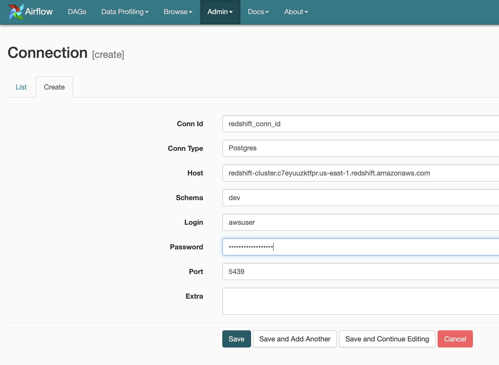
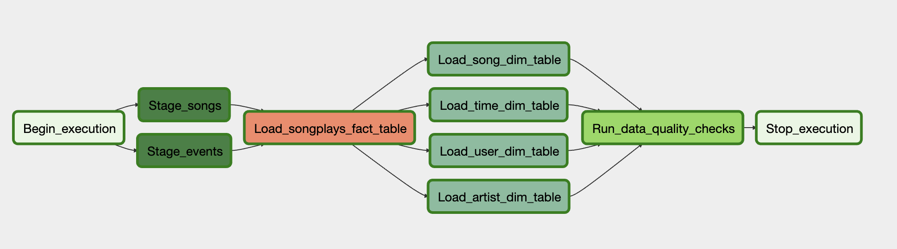
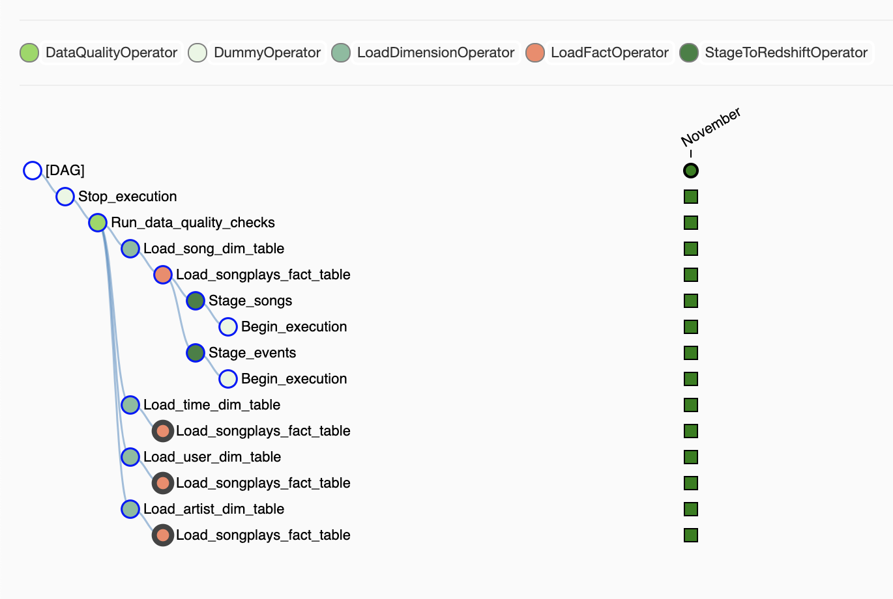

# Project: Data Pipelines with Airflow


## Scope of the project

The aim of this project is to build an ETL pipeline on Airflow for a fictious company Sparkify.
The pipeine will load data from S3 to Redshift and transform them to a Star Schema, making them
suitable for consumption from B.I. applications.

## Getting Started

### Set up Redshift

The first step is to launch an AWS Redshift cluster, preferably in the `us-west-2` region so that it's closer to
the S3 data that we will load.

Also, make sure to associate an IAM role for accessing S3 from Redshift.

Finally the cluster should be publicly accessible, because we will be running Airflow in our local PC and not on AWS.

### Create the tables in Redshift

First we need to create all of the tables in Redshift. We can do this by running the `create_tables.sql` file in this project like this.

```bash
psql --host=<redshift-endpoint.region.redshift.amazonaws.com> --port=<port> --username=<user> --file=./airflow/create_tables.sql <redshift-database>
```

### Start Airflow and configure the Redshift connection

Start Airflow locally by running the scheduler and the webserver in deamon mode:

```bash
airflow scheduler --daemon
airflow webserver --daemon -p 3000
```

Once Airflow is running, use the web UI to setup a new connection to Redshift (Admin/Connections/Create).

Fill the parameters for the new connection. It should look like the following:



Note that for accessing Redshift we will be using the `Postgres` connection type.

Finally trigger the DAG by turning it on.

Note: Given the data that currently reside in S3, one will have to change the end_date and a few other parameters
in the main etl file before running it. Please see the instructions in the file.

## Airflow Pipelines Design



The pipeline consists 3 different types of Airflow Operators. By splitting the functionality in small
reusable Operators we make the code more flexible and robust.

The first step is to stage the data from S3 to Redshift. This is achieved with the `StageToRedshift` operator.
We simply COPY them into Redshift so that we can easily transform them to the target schema.

After having staged the data to Redshift, we will create our fact and dimension tables. This is done with the
`LoadFactOperator` and `LoadDimensionOperator`. Given that the dimension tables are usually much smaller in size
we give the option of backfilling them with the TRUNCATE-INSERT pattern. This means that the tables are being deleted
before inserting the data again. The fact table is often very big, and it is not efficient.

Finally, we are performing data quality checks with the `DataQualityOperator`. It accepts a list of SQL queries and
expected results. It verifies that the loaded data are as expected.


