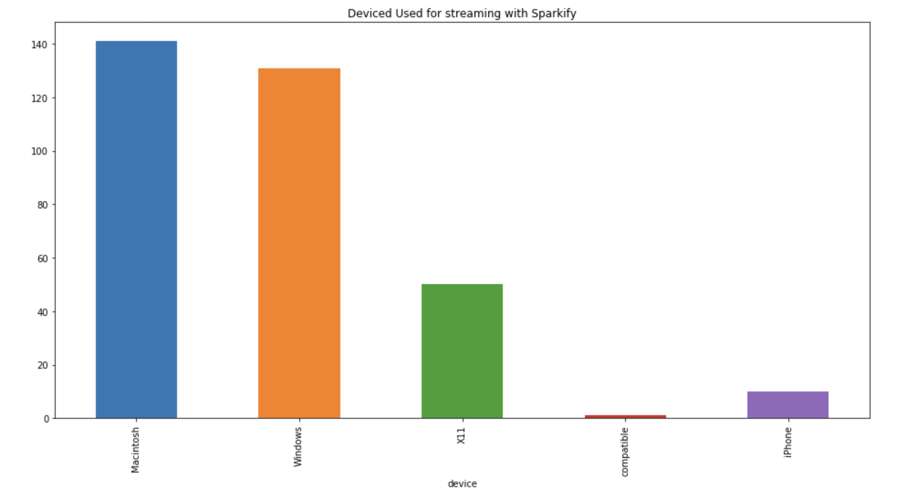

# Sparkify Data Warehouse in Amazon Redshift


## Summary

The following document describes the implementation of a Data Warehouse for the fictional startup company Sparkify, which is in the business of music streaming.

The project was written as part of the Udacity Data Engineering nanodegree.


## Getting Started


### How to run the code

1. Create the Amazon Redshift cluster (see section: *Setting up the Resdshift cluster*).
2. Copy the AWS configuration parameters in the configuration file of this project `dwh.cfg`.
3. Run the Python script `create_tables.py`.
4. Run the Python script `etl.py`.
5. Execute the IPython notebook `dashboard.ipynb` - a dashboard providing analytics.


### Files in this repository


| File                   | Description                                                                                    |
|------------------------|------------------------------------------------------------------------------------------------|
| redshift_template.json | AWS Cloudformation JSON template that deploys a publicly accessible Redshift cluster.          |
| sql_queries.py         | Python script with static templates for creating/droping/inserting to tables for the database. |
| create_tables.py       | Python script to drop and create tables for the database.                                      |
| etl.py                 | Python script for copying data from Redshift into S3 and then transforming them to Star schema.|
| dwh.cfg                | Global configuration for the project.                                                          |
| dashboard.ipynb        | IPython notebook with analytics queries for the database.                                      |


## Overview


### Purpose of the database

The purpose of the database is to store data that was produced with Online Transaction Processing (OLTP) accessible
and useful for Business Intelligence (BI) applications. This will enable the company to answer questions
about the app usage and make strategic decisions based on quantitative factors.


### Methodology

In order to achieve this we ingest data from two data sources (initially residing in Amazon S3):
- Event logs from the app usage
- Database of songs and artists

Using an Extract-Transform-Load (ETL) process we store the data into staging tables in Amazon Redshift.
As part of the ETL process we use SQL-to-SQL transformation in Redshift to transform the initial staging
tables into a Star Schema, which is more suitable for Online Analytical Processing (OLAP).


## Database Design

For this analytics database we will use the Star schema. The focus is to provide to analytics users an 
intuitive schema, so that they can get insights from the data without having to use complex queries
with multiple JOINs.

Storing the data in a Star schema means that we can accept the data to be denormalized and we don't
apply the same strict constraints as we would do with a 3rd Normal Form design.


Specifically, the design includes one big fact table, named `songplays` and multiple dimension tables
- `users`
- `songs`
- `artists`
- `times`

The relation between our tables (entities) can be seen in the following diagram:


The diagram was generated using [draw.io](https://www.draw.io).


We provide a detailed description of the different fields in the table below:

|Entity             | Field            | Description                                                                                    |
|-------------------|------------------|------------------------------------------------------------------------------------------------|
|   songplays       |   songplay_id    | Unique ID of the songplay event. Assigned by Resdshift.                                        |
|                   |   start_time     | Timestamp of when the song was played.                                                         |
|                   |   user_id        | ID of the user that created this action.                                                       |
|                   |   level          | Level of the user free/paying.                                                                 |
|                   |   song_id        | ID of the song that the user is listening to.                                                  |
|                   |   artist_id      | ID of the artist that produced the song.                                                       |
|                   |   session_id     | ID the user session for playing songs.                                                         |
|                   |   location       | Location of the artist.                                                                        |
|                   |   user_agent     | User-agent request header.                                                                     |
|   users           |   user_id        | ID of the user.                                                                                |
|                   |   first_name     | First name of the user.                                                                        |
|                   |   last_name      | Last name of the user.                                                                         |
|                   |   gender         | Gender of the user.                                                                            |
|                   |   level          | Level of the user - free/paying.                                                               |
|   songs           |   song_id        | ID of the song.                                                                                |
|                   |   title          | Title of the song.                                                                             |
|                   |   artist_id      | ID of the artist that produced the song.                                                       |
|                   |   year           | Year when the song was produced.                                                               |
|                   |   duration       | Duration of the song (in seconds).                                                             |
|   artists         |   artist_id      | ID of the artist.                                                                              |
|                   |   name           | Name of the artist.                                                                            |
|                   |   location       | Location of the artist.                                                                        |
|                   |   latitude       | Latitude of the artist.                                                                        |
|                   |   longitude      | Longitude of the artist.                                                                       |
|   times           |   start_time     | Timestamp of an event. This entity is useful for analysis.                                     |
|                   |   hour           | Hour of the event.                                                                             |
|                   |   day            | Day of the event.                                                                              |
|                   |   week           | Week of the event.                                                                             |
|                   |   month          | Month of the event.                                                                            |
|                   |   year           | Year of the event.                                                                             |
|                   |   weekday        | Weekday of the event.                                                                          |


 
### Table optimization

Redshift is a Masivelly Parallel Processing (MPP) database.
It is designed so that data are split into multiple computational slices, with dedicated memory.
Thus, each SQL query can be executed in parallel across multiple slices, for improved performance.

In order to take advantage of this database model we need to ensure that our tables are designed appropriately.
Specifically, we will try to eliminate shuffling, by using the distribution style ALL for our smaller dimensional
tables (`songs`, `artists`). This will ensure that all of the entries of these are being duplicated in all slices,
thus making join operations fast.

Additionally, given that the dimension table `users` is expected to be bigger and we will need to frequently join with
the fact table `songplays`, we will make sure to co-locate records from the two tables with the same `user_id` in the same
slices. In other words, we will set the `user_id` as a distribution key.

Finally, setting reasonable sort keys for the tables ensures that data are being stored sorted in each slice.
Hence, the most frequently used `order-by` operation will be faster. We chose the `song_title`, `artist_name`, `start_time` as 
reasonable choices for sort keys in the corresponding tables.


## Implementation Process

The following sections describe in detail, design choices and the steps taken for the implementation of this project.
We highlight intereting points and lessons learnt.


### Setting up the Resdshift cluster


#### Selection of the AWS region

We do not have any particular constraint about the AWS region that we need to use to run the cluster.
The raw data reside in an S3 bucket inside the `us-west-2` region.

Thus, we will run our cluster in this region, in order to minimize the time needed for copying the data into
Redshift.


#### Accessing S3 from Redshift - IAM role

For this project we need to access an S3 Bucket from Redshift in order to copy the data.
AWS supports roles for Access Management so that one AWS service (here Redshift) can connect and access another one (in our case S3).

Specifically, a role is an identity with a set of permissions attached to. In our case, we will need a role that provides read-only access to S3.
Redshift can then *assume* this role, to access the data. A useful description about roles can be found in the [docs](https://docs.aws.amazon.com/IAM/latest/UserGuide/id_roles.html).

We will need to keep a note of the Amazon Resource Name ([ARN](https://docs.aws.amazon.com/general/latest/gr/aws-arns-and-namespaces.html)) for our
role, so that we can embed in the SQL queries that copy data from S3.


#### Infrastructure as Code - Amazon Cloudformation

For easier deployment of the Infrastucture an AWS Cloudformation template was used.
Starting with the sample Redshift template from the [AWS docs](https://docs.aws.amazon.com/AWSCloudFormation/latest/UserGuide/quickref-redshift.html), 
we modified it to include a role that gives access to S3 from Redshift. We also added an Internet Gateway and the correspoding Route Table for the Redshift 
subnet, to make the cluster accessible from the Internet.

The template reads the database password as and input and once it creates the required resources it will output all the required parameters for connecting to
the cluster. That includes:
- cluster endpoint
- IAM role ARN
- database name
- database port
- database user


### Extracting data from S3

The following section describes how we are going to extract data from S3 and stage them in Redshift.


#### Specifying the S3 objects to read from

There are three ways to specify the S3 files that we are going to extract data from:
- full path
- prefix
- manifest file

The first method is straightforward we simply provide the full URL for the S3 file that we want to load data from.

With the second approach we specify only the common URL prefix of the S3 objects that we want to read data from.
The COPY command will then use this prefix to load the all of the files which start with this prefix.

Finally, we can use a manifest file, i.e. a JSON file that specifies explicitly the files that we want to use.

In the Sparkify project we are going to use the second method for extracting `log` and `song` data.
The data are split into multiple files, which share the same prefix.

This are for example some of the `log` files:
```
s3.ObjectSummary(bucket_name='udacity-dend', key='log_data/')
s3.ObjectSummary(bucket_name='udacity-dend', key='log_data/2018/11/2018-11-01-events.json')
s3.ObjectSummary(bucket_name='udacity-dend', key='log_data/2018/11/2018-11-02-events.json')
s3.ObjectSummary(bucket_name='udacity-dend', key='log_data/2018/11/2018-11-03-events.json')
s3.ObjectSummary(bucket_name='udacity-dend', key='log_data/2018/11/2018-11-04-events.json')
```

and similarly for the `song` data files:
```
s3.ObjectSummary(bucket_name='udacity-dend', key='song_data/')
s3.ObjectSummary(bucket_name='udacity-dend', key='song_data/A/A/A/TRAAAAK128F9318786.json')
s3.ObjectSummary(bucket_name='udacity-dend', key='song_data/A/A/A/TRAAAAV128F421A322.json')
s3.ObjectSummary(bucket_name='udacity-dend', key='song_data/A/A/A/TRAAABD128F429CF47.json')
s3.ObjectSummary(bucket_name='udacity-dend', key='song_data/A/A/A/TRAAACN128F9355673.json')
```
It's worth keeping in mind that there is no concept of directory structure in S3. In other words, it is flat key-value store.
However, having a forward-slash in the key can provide context for clients, by grouping the data logically.


#### Choosing the JSON fields to copy

When using the COPY command, there are three ways that we can specify how we want to load data from JSON files to the Redshift database.
- auto
- auto ignorecase
- jsonpaths file: `s3://json_paths_file`

In the first case the COPY command will automatically load the fields from the JSON file and we don't need to be explicit.

The second case `auto ignorecase` is similar, but the COPY operation will also ignore the capitalization of the JSON field names.

The third option gives us more flexibitly to choose how we are going to extract fields from the JSON file.
We specify a special file called of JSONPaths where we define how we want to parse the JSON files for the COPY operation.

According to the [documentation](https://docs.aws.amazon.com/redshift/latest/dg/copy-usage_notes-copy-from-json.html), the JSONPaths file
is a JSON file itself, with a single field named `jsonpaths` and an array of the field names that we want to extract.

In our use-case, we are using a JSONPaths file for specifying the fields that we are going to use from the logs. This is how it looks like:
```json
{
    "jsonpaths": [
        "$['artist']",
        "$['auth']",
        "$['firstName']",
        "$['gender']",
        "$['itemInSession']",
        "$['lastName']",
        "$['length']",
        "$['level']",
        "$['location']",
        "$['method']",
        "$['page']",
        "$['registration']",
        "$['sessionId']",
        "$['song']",
        "$['status']",
        "$['ts']",
        "$['userAgent']",
        "$['userId']"
    ]
}
```
As can be seen in the configuration file `dwh.cfg`, the JSONPaths file for this project can be found in the following location: `s3://udacity-dend/log_json_path.json`


### Loading data into Redshift

#### Bulk upload

According to the Amazon documentation [best-practices](https://aws.amazon.com/blogs/big-data/top-8-best-practices-for-high-performance-etl-processing-using-amazon-redshift/),
when transforming and loading data into Redshift, as part of an ETL process, it's best to do all of the steps in a single transaction.

The reason for that is the high cost of the COMMIT in Redshift. Hence, we surround our SQL-queries in `etl.py` within a single commit-block.


#### SQL-to-SQL transformation

For transforming and moving data from the staging tables into the analytics tables,
we are using the INSERT INTO statement as described in the [docs](https://docs.aws.amazon.com/redshift/latest/dg/r_SELECT_INTO.html).
Starting with the `songs`, we need to select a subset of the columns from the `staging_songs table` for insertion.

Similarly, for the `artists` table, we only need to select a subset of the columns from the `staging_songs` temporary table.
However, we should be careful to select DISTINCT rows, since one artist can appear multiple times in the database.
Once for every song.

For the `times` table we need to be a bit more careful, since we will need to derive data for the columns based on the timestamp.
We will have to handle the timestamps correctly as discribed in the **Timestamp handling** section of this document.


For the `users` table we will transform data from the `staging_events` table. Similar to the `artists` table we should be careful 
to include user data only once.


Finally, we transform and load data into the fact table `songplays`, by joining the two staging tables (`staging_events` and `staging_songs`).


#### Timestamp handling


The timestamps of the events in the S3 database is stored in Unix epoch format. The are stored as integer numbers counting the number of seconds
(or a fraction of seconds) that passed since 1970-01-01. 

For example, one row of the dataset shows that the column `ts` shows an integer with the number of milliseconds that passed since this time.

```json
{'artist': "Des'ree",
 'auth': 'Logged In',
 'firstName': 'Kaylee',
 'gender': 'F',
 'itemInSession': 1,
 'lastName': 'Summers',
 'length': 246.30812,
 'level': 'free',
 'location': 'Phoenix-Mesa-Scottsdale, AZ',
 'method': 'PUT',
 'page': 'NextSong',
 'registration': 1540344794796.0,
 'sessionId': 139,
 'song': 'You Gotta Be',
 'status': 200,
 'ts': 1541106106796,
 'userAgent': '"Mozilla/5.0 (Windows NT 6.1; WOW64) AppleWebKit/537.36 (KHTML, like Gecko) Chrome/35.0.1916.153 Safari/537.36"',
 'userId': '8'}
```

In this example, `ts = 1541106106796 = Thu Nov 01 2018 21:01:46 GMT+0000`.
[unixtimestamp.com](https://www.unixtimestamp.com/index.php) is useful for quick timestamps conversions.


This is a very convenient and efficient format for storing the data for data processing, however, a bit cumbersome to use in
BI applications.

Thus, we will convert these numbers to the Redshift `timestamp` data type while populating the `songplays` table.
Given the definition of the Unix epoch format, it is straightforward to create the Redshift timestamp data types using the
[DATEADD](https://docs.aws.amazon.com/redshift/latest/dg/r_DATEADD_function.html) function.


Additionally, we create one additional dimensional table, named `times`.
This table is being used for convenience as it splits a given timestamp, which is defined in the column `start_time`
(i.e. the time of the request) into its constituents (hour, day, week, ... etc.)
This should make analytical queries easier and more intuitive.

In order to achieve this, we will use the [EXTRACT](https://docs.aws.amazon.com/redshift/latest/dg/r_EXTRACT_function.html) command in Redshift to make the conversion.

Notice, that we already converted the Unix timestamps to Redshift `timestamp` data type, during the backfill of the songplays table.


## Analytics Dashboard

The newly created database gives us flexibility to explore the dataset using simple SQL queries.
We have prepared an IPython dashboard that can help us answer questions about the app usage. For example,

"What are the most commonly used devices for accessing Sparkify?"



